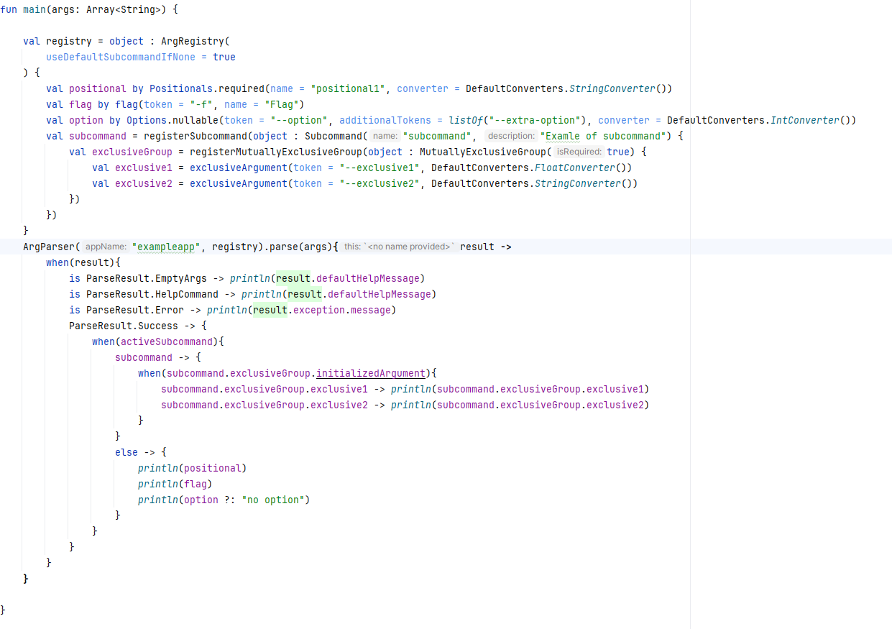

# Kotlin-argparser

### A simple kotlin framework for a quick-start command-line applications


### Requirements
In order to use this library withing your gradle projects:

1) Add maven repository into your `settings.gradle.kts`:
```
dependencyResolutionManagement{
    repositories{
        maven("https://repo.repsy.io/mvn/davidzhubrev/public")
    }
}
```
or into your root `build.gradle.kts`:
```
repositories {
    maven("https://repo.repsy.io/mvn/davidzhubrev/public")
}
```

2) Then, into your module's `build.gradle.kts` file:
```
dependencies {
    implementation("com.appdav:kotlin-argparser:version")
}
```

3) Also, because this library uses context-receivers kotlin feature, which is not stable yet, you have to add this compiler argument into your `build.gradle.kts` file:
```
tasks.compileKotlin {
    compilerOptions {
        freeCompilerArgs.add("-Xcontext-receivers")
    }
}
```
4) Sync your gradle project to let it download dependency and after that you are ready to go

### Quick-start guide
There are a number of ways you can use this framework. For a quick-start you can use anonymous `ArgRegistry` child:
1) Create an object that extends `ArgRegistry`
2) Pass it to the `ArgParser` instance
3) Use the `ArgParser.parse()` method to start parsing process
4) Use result of the `ArgParser.parse()` method or use the overloaded version which accepts a lambda with your registry as a context and result as a parameter

### 1. Create an object that extends ArgRegistry
```
  val registry = object : ArgRegistry(useDefaultSubcommandIfNone = true) {
      val positional by Positionals.required(name = "positional1", converter = DefaultConverters.StringConverter())
      val flag by flag(token = "-f", name = "Flag")
      val option by Options.nullable(token = "--option", additionalTokens = listOf("--extra-option"), converter = DefaultConverters.IntConverter())
      val subcommand = registerSubcommand(object : Subcommand("subcommand", "Examle of subcommand") {
          val exclusiveGroup = registerMutuallyExclusiveGroup(object : MutuallyExclusiveGroup(true) {
              val exclusive1 = exclusiveArgument(token = "--exclusive1", DefaultConverters.FloatConverter())
              val exclusive2 = exclusiveArgument(token = "--exclusive2", DefaultConverters.StringConverter())
          })
      })
  }
```
Here, we create an anonymous object that extends `ArgRegistry`.
Then, we create a few arguments for the command-line. Different registries (which basically is a collection of arguments)
provides DSL for creating different types of arguments. `ArgRegistry` provides DSL for creating flags, positional arguments,
options, subcommands and mutually-exclusive groups. More info about argument types below.

### 2. Pass your ArgRegistry instance into ArgParser instance

```
val parser = ArgParser("appname", registry)
```
ArgParser accepts appname, which is used in help messages, generic ArgRegistry instance and list of help tokens, which are defaulted to listOf("help", "--help", "-h"). 
Help tokens are used to call help messages for ArgRegistry and all the subcommands inside.

### 3. Call ArgParser's parse() method
```
val result: ParseResult = parser.parse(args, ignoreUnknownOptions = false)
```
`ArgParser.parse()` accepts two parameters: string array which is basically an argument array for your application, and an `ignoreUnknownOptions` flag.
The first is provided by your application's main method, and the later tells ArgParser if it should ignore unknown and unregistered tokenized arguments or return an error if one is found. It is recommended to use default value, which is false.
Also, there is an overloaded version of parse method, which returns Unit, but accepts a lambda, which provides your registry as a `this` and a `ParseResult` as a parameter.
```
parser.parse(args, false){ result: ParseResult ->
    //Here, registry can be accessed as `this`
    //Do some stuff with your parse result
    ...
}
```

### 4. Use parse result to check what happened during parsing process
ParseResult is a sealed class which provides info about what happened during parsing process:
```
  ArgParser("exampleapp", registry).parse(args, ignoreUnknownOptions = false){result ->
      when(result){
          //EmptyArgs means no arguments were passed to the command-line
          //This type of result has defaultHelpMessage property which provides basic info about CLI
          is ParseResult.EmptyArgs -> println(result.defaultHelpMessage)
          
          //HelpCommand means that one of the help tokens of the ArgParser were found
          //This type of result has defaultHelpMessage property which is generated for your registry 
          is ParseResult.HelpCommand -> println(result.defaultHelpMessage)
          
          //This type of result means an exception has been thrown while parsing.
          //It has exception property, which can be used to provide message, be re-thrown or etc.
          is ParseResult.Error -> println(result.exception.message)
          
          //Success is a singleton, which does not provide any additional info and just means that parsing was successful
          ParseResult.Success -> {
              TODO("Here you can access your registry and do stuff to your arguments")
          }
      }
  }
```

## Argument types
`ArgRegistry` is a basic entry-point registry for the `ArgParser`. But it is not the only one registry.
Here, registry is a collection of arguments, which can be iterated through, filtered etc.
All registries provide different DSL for creating arguments. `ArgParser` provides DSL for creating flags, options, positional arguments, subcommands and mutually-exclusive groups.
### Positional argument
Positional arguments are arguments which has no tokens and just parsed one-by-one. For instance, if your registry looks like this:
```
val registry = object : ArgRegistry() {
    val a1 by Positionals.required("a1", DefaultConverters.IntConverter())
    val a2 by Positionals.required("a2", DefaultConverters.IntConverter())
    val a3 by Positionals.required("a3", DefaultConverters.IntConverter())
}
```
your command-line input will look like this:
```
myapplication 10 2 3
```
This will assign `a1` as 10, `a2` as 2 and `a3` as 3. As you can see, positional arguments are called that way because they depend on position of the provided input arguments.
There are 3 types of Positional arguments that can be registered via DSL:
- `Positionals.required` - creates required argument, which is not-nullable. If argument is missing, `ParseResult.Error` is returned by parser 
- `Positionals.nullable` - creates a nullable argument, which can be null, but does not throw an exception if not present in command-line input
- `Positionals.withDefaultValue` - creates a non-nullable argument, which will return provided default value if not present in command-line input

### Options
Options are arguments that are passed in a key-value format. Options have tokens that determinate them in command-line arguments and a value that goes right after the token.
For instance:
```
  val registry = object: ArgRegistry(){
      val option1 by Options.required("--string-option", DefaultConverters.StringConverter())
      val option2 by Options.required("--int-option", DefaultConverters.IntConverter())
  }
```
and your input can be like that:
```
myapplication --string-option "hello world" --int-option 12
```
This will assign option1 with the value of "hello world", and the option2 with 12.
Because options have tokens, their order is irrelevant.

It is considered a good practice to follow those rules when creating a token:
- It should be lowercase
- It should start with 2 hyphens, 1 hyphen for the short version (if you have --string-option token, you can also provide it with -s additional token, but be sure it does not cross with another arguments)
- If made of 2 or more words, use hyphen to separate
Although, you can use any string (without spaces) when using this framework, it is a bad idea not to follow those general rules, because it may be misleading and hard to understand for the end-user.

There are 3 types of Options:
- `Options.required` - creates a non-nullable option that is required and `ParseResult.Error` is returned as a result if this option is missed
- `Options.nullable` - creates a nullable option
- `Options.withDefaultValue` - creates a non-nullable option that will return provided default value if input lacks this option

### Flags
Flags are simple usually one-letter tokenized arguments that are used as a toggles.
```
val registry = object: ArgRegistry(){
    val flag by Flags.flag("-f", name = "flag")
    val invertedFlag by Flags.invertedFlag("-inv", name = "inverted")
}
```
All the flags have Boolean type. They have false value if not found in the command-line input and true otherwise
If your input is:
```
myapplication -f
```
 your flag will have true value.

InvertedFlags, on the opposite, have true value by default, and become false if found in command-line input
For instance:
```
myapplication -inv
```
will make `invertedFlag` false 
 
### Subcommands
Subcommands are a nested registries which have a token. Subcommands are used when your application has complex functionality and provides a multiple modes or behaviours.
For instance, let's make a simple calculator with 2 different subcommands: addition and subtraction:
```
  //You can use different scopes extensions in order to make your code cleaner when your different subcommands use same arguments
  fun PositionalRegistryScope.createArg(name: String) = Positionals.required(name, DefaultConverters.FloatConverter())
  
  val reg = object : ArgRegistry() {
      val addition = registerSubcommand(object : Subcommand("add", "Adds 2 numbers"){
          val arg1 by createArg("a1")
          val arg2 by createArg("a2")
      })
      val subtraction = registerSubcommand(object : Subcommand("subtract", "Subtract 2 numbers"){
          val arg1 by createArg("a1")
          val arg2 by createArg("a2")
      })
  }
```
Then, we parse our arguments and print results of the operations for the user. 

In order to check which of the subcommand is active, we can use `activeSubcommand` property and compare it with all the registered ones: 
```
ArgParser("exampleapp", reg).parse(args, ignoreUnknownOptions = false) { result ->
    when (result) {
        is ParseResult.EmptyArgs -> println(result.defaultHelpMessage)
        is ParseResult.HelpCommand -> println(result.defaultHelpMessage)
        is ParseResult.Error -> println(result.exception.message)
        ParseResult.Success -> {
            when (activeSubcommand) {
                addition -> println(addition.arg1 + addition.arg2)
                subtraction -> println(subtraction.arg1 - subtraction.arg2)
            }
        }
    }
}
```
Input example:
```
exampleapp add 10 20 //will print 30.0
exampleapp subtract 10 20 //will print -10.0
```

Subcommands can be nested in order to make your CLI even more complex. 
```
val registry = object : ArgRegistry(){
    val subcommand = registerSubcommand(object : Subcommand("mainsubcommand"){
        val nested = registerSubcommand(object : Subcommand("nested"){
            val evenMoreNested = registerSubcommand(object : Subcommand("evenmorenested"){
                //TODO: register any arguments here
            })
        })
    })
}
```
All the registries that provide DSL for registering subcommands use `useDefaultSubcommandIfNone` flag (ArgRegistry and Subcommand have it as their constructor parameter).
This flag is ignored if no subcommands registered. But if subcommands registered, if this flag is false and no subcommand found by the provided tokens, an error will be returned. If flag is true, the parent registry will be used in a parsing process.

For instance:
```
  val reg = object : ArgRegistry(useDefaultSubcommandIfNone = false) {
      val addition = registerSubcommand(object : Subcommand("add", "Adds 2 numbers"){
          val arg1 by createArg("a1")
          val arg2 by createArg("a2")
      })
      val subtraction = registerSubcommand(object : Subcommand("subtract", "Subtract 2 numbers"){
          val arg1 by createArg("a1")
          val arg2 by createArg("a2")
      })
      val positional by Positionals.required("positional", DefaultConverters.StringConverter())
  }
    
```
For input:
```
myapplication 12 //Will return ParseResult.Error as a result
```

But if we pass true for the useDefaultSubcommandIfNone:
```
val reg = object : ArgRegistry(useDefaultSubcommandIfNone = false) {
...
```
```
myapplication 12 //positional is "12" now
```

### Mutually exclusive groups
Mutually exclusive groups are grouped arguments that does not allow to pass more than one argument.
```
  val reg = object : ArgRegistry(useDefaultSubcommandIfNone = false) {
      val user = registerMutuallyExclusiveGroup(object : MutuallyExclusiveGroup(isRequired = true){
          val username by exclusiveArgument("--username", DefaultConverters.StringConverter())
          val email by exclusiveArgument("--email", DefaultConverters.StringConverter())
      })
  }
 ```
 `MutuallyExlusiveGroup` has required flag, which tells parser if one of the arguments must be initialized. If group is required, one and only one of the arguments will be initialized. If not required, it's one or zero arguments initialized.
 
 In order to check which of the arguments is initialized, `MutuallyExclusiveGroup` has `initializedArgument` property, which can be used for comparing:
 ```
  val reg = object : ArgRegistry(useDefaultSubcommandIfNone = false) {
      val user = registerMutuallyExclusiveGroup(object : MutuallyExclusiveGroup(isRequired = true){
          val username = exclusiveArgument("--username", DefaultConverters.StringConverter())
          val email = exclusiveArgument("--email", DefaultConverters.StringConverter())
      })
  }
  ArgParser("exampleapp", reg).parse(args, ignoreUnknownOptions = false) { result ->
      when (result) {
          is ParseResult.EmptyArgs -> println(result.defaultHelpMessage)
          is ParseResult.HelpCommand -> println(result.defaultHelpMessage)
          is ParseResult.Error ->
              println(result.exception.message)
          ParseResult.Success -> {
              when (user.initializedArgument) {
                  //Username is initialized
                  user.username -> println("Username is: ${user.username.value}")
                  //Email is initialized
                  user.email -> println("User email is: ${user.email.value}")
              }
          }
      }
  }
```
##### Note: if you want to use that feature, you cannot use `by` keyword for your arguments, because this will make your properties be the value, not the argument
Mutually exclusive group provides DSL for creating `exclusiveArguments` only, you cannot register subcommands or any other types of arguments.

## ValueConverter
All the arguments accept `ValueConverter` interface as an argument (except for flags, which have special converter). `ValueConverter` is a simple functional interface, which converts String input into any other type.
You can make your arguments return value of any type by passing your own ValueConverter:
```
data class Example(
        val name: String,
        val value: Int,
    )

val reg = object : ArgRegistry(useDefaultSubcommandIfNone = false) {
    val example by Positionals.required("example-arg", ValueConverter<Example> { input ->
        //Let's say we pass arguments in a format of name:value
        try {
            val (name, value) = input.split(":")
            Example(name, value.toInt())
        } catch (e: Exception){
            throw ValueConversionException(input, Example::class)
        }
    })
}
```

`Kotlin-argparser` framework provides `DefaultConverters`, which has a number of different ValueConverters implementations, including String, Boolean, Numbers, java.io.File and Enum converters.

### What's next?
This framework is at its early developing process, so it can have some minor bugs. Feel free to post issues.

The only goal of this framework is to make CLI developing fun, fast and convenient, and I hope that `kotlin-argparser` will make it that way :)
